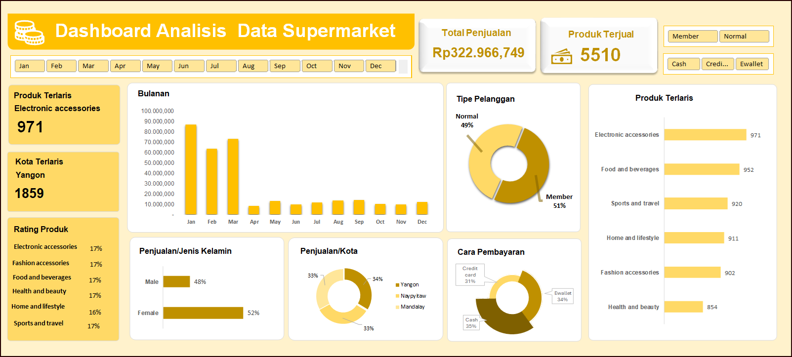

# 🏪 Dashboard Analisis Data Supermarket

Dashboard ini menampilkan **analisis performa penjualan dan perilaku pelanggan** berdasarkan data transaksi dari sebuah supermarket.  
Visualisasi dibuat untuk membantu memahami tren pembelian konsumen, pola transaksi, serta distribusi pelanggan berdasarkan kategori penting seperti **jenis kelamin, metode pembayaran, dan periode waktu**.

---

## 🎯 Tujuan
Dashboard ini dibuat untuk memberikan insight berbasis data terkait performa bisnis supermarket, mencakup:
- Analisis penjualan bulanan.
- Distribusi pelanggan berdasarkan **gender** dan **metode pembayaran**.
- Pemantauan tren penjualan dari waktu ke waktu untuk mendukung pengambilan keputusan strategis.

---

## 🚀 Fitur Utama
- 📆 **Penjualan Bulanan:** Melihat tren performa penjualan setiap bulan.  
- 👥 **Distribusi Pelanggan:** Menampilkan proporsi pelanggan berdasarkan jenis kelamin.  
- 💳 **Metode Pembayaran:** Visualisasi preferensi pelanggan terhadap metode pembayaran (Cash, E-wallet, Credit Card, dll).  
- 📊 **Ringkasan Penjualan:** Total penjualan, rata-rata transaksi, dan metrik utama lainnya.

---

## 🛠️ Tools yang Digunakan
- **Google Sheets / Excel** – untuk pengolahan dan visualisasi data.  
- **Data Source:** Dataset penjualan supermarket (transaksi pelanggan, metode pembayaran, dan gender).  
- **Visualization:** Chart dan diagram untuk menampilkan insight secara interaktif.

---

## 📈 Hasil Dashboard

---

## 🔍 Insight Utama
- Terdapat **perbedaan signifikan dalam preferensi metode pembayaran** antara pelanggan pria dan wanita.  
- **Tren penjualan meningkat secara konsisten** pada bulan-bulan tertentu, menunjukkan periode belanja tinggi.  
- Sebagian besar pelanggan memilih **metode pembayaran non-tunai**, menunjukkan adopsi digital payment yang tinggi.  

---

## 💡 Kesimpulan
Dashboard ini memberikan gambaran komprehensif tentang performa penjualan supermarket serta perilaku pelanggan.  
Dengan memahami tren dan distribusi pelanggan, bisnis dapat menyusun strategi pemasaran yang lebih efektif, seperti promosi berbasis gender atau periode diskon pada bulan dengan performa tinggi.

---

## 👩‍💻 Pembuat
**Nama:** Silvi  
**Tools:** Google Sheets / Excel Visualization  
**Tahun:** 2025  

---

## 📄 Lisensi
MIT License
